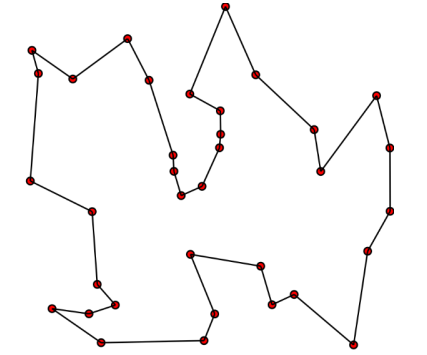
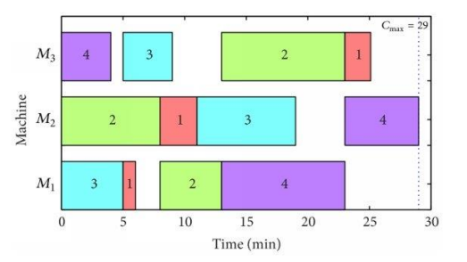

# Evolutionary Algorithms

This repository contains the first assignment for the course ```CS 451 - Computational Intelligence```. The assignment is about ```Evolutionary Algorithms```, and optimizing certain problems using evolutionary algorithms. 

The purpose of this assignment is to provide students an insight of stochastic optimization using Evolutionary Algorithms (EA). This exercise will enable them to address some popular computing problems that can be mapped to map to several real-world problems and are known to be computationally hard. The process will expose them to the overall process of EA, its underlying challenges and the impact of different parameters and selection schemes.

The main problems optimized in this assignment are:
- **Travelling Salesman Problem (TSP)**
- **Job Shop Scheduling Problem (JSSP)**

### Travelling Salesman Problem (TSP)
TSP asks the following question: "Given a list of cities and the distances between each pair of cities, what is the shortest possible route that visits each city exactly once and returns to the origin city?" 

For the purpose of this assignment, the Qatar dataset was used that contains 194 cities. The optimal tour reported so far for this dataset is of length **9352**, (and the best achieved by any student previously in this course was **9939** - we beat this score to **9854**). The dataset and its related details can be found [here](http://www.math.uwaterloo.ca/tsp/world/countries.html) - Qatar dataset was used from here. 

### Job Shop Scheduling Problem (JSSP)

JSSP is a widely studied combinatorial, NP-hard optimization problem. The aim of the problem is to find the optimum schedule for allocating shared resources over time to competing activities in order to reduce the overall time needed to complete all activities. 

Within a JSSP you will have $n$ number of jobs $(J1, J2, ..., Jn )$, that will need to be completed using a $m$ number shared resources, most commonly denoted as machines $(M1, M2, ..., Mm)$. Each job will have operations $(O)$ that will need to be completed in a specific order in order for the job to be completed. Operations must be completed at specific machines and require a specific amount of processing time $(p)$ on that machine. Machines are assumed to only be able to process one operation at a time, driving the need to optimize the order in which these operations are completed. The goal of the JSSP is to minimize the overall time it takes to complete all n jobs within the problem. 

Data was taken from [here](http://people.brunel.ac.uk/~mastjjb/jeb/orlib/files/jobshop1.txt) - the first 3 instances; abz5, abz6, abz7 will be used.

### Evolutionary Algorithm

The [evolAlgs.py](evolAlgs.py) file contains the class that implements our evolutionary algorithm for both the problems. The class is responsible for the evolutionary cycle, including the parent selection, and survival selection based on provided selection schemes implemented in the [selecSchemes.py](selecSchemes.py) file which will be explained in the next section. 


### Selection Schemes Implemented